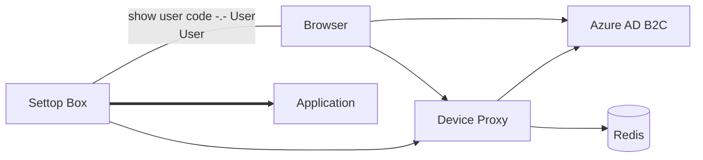
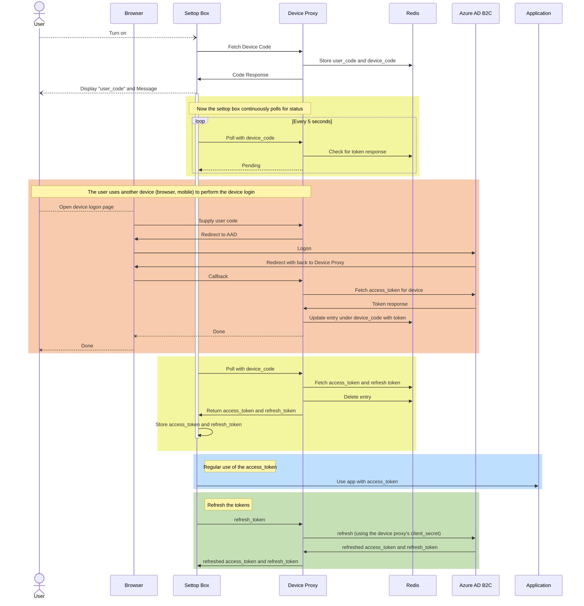

# Device Flow Authentication for Azure AD B2C

## Component relations



## Interactions




## Example local config

```json
{
  "IsEncrypted": false,
  "Values": {
    "AzureWebJobsStorage": "UseDevelopmentStorage=true",
    "FUNCTIONS_WORKER_RUNTIME": "dotnet",
    "Config:AppId": "",
    "Config:AppSecret": "",
    "Config:Tenant": "myb2c",
    "Config:RedirectUri": "http://localhost:7071/authorization_callback",
    "Config:SignInPolicy": "B2C_1A_signup_signin",
    "Config:VerificationUri": "http://localhost:7071",
    "Config:Redis": "localhost",
    // optional: configure custom html pages (e.g. load from a blob storage)
    "Config:UserCodePage": "http://localhost:8080/usercode.html",
    "Config:SuccessPage": "http://localhost:8080/success.html",
    "Config:ErrorPage": "http://localhost:8080/error.html"
  }
}
```


## Start on device

```
POST https://service-device-auth-flow.azurewebsites.net/oauth/device_authorization
Accept: */*
Content-Type: application/x-www-form-urlencoded
Cache-Control: no-cache

clientId=clientId&scope=offline_access
```

Example Response:

```
{
    "device_code":"9ab010de-9fe7-4f62-96c9-e9498004211e",
    "user_code":"211313","verification_uri":"https://service-device-auth-flow.azurewebsites.net/",
    "expires_in":300
}

```

## Navigate to website

https://service-device-auth-flow.azurewebsites.net/

Enter User Code and login

### Poll for token on device

```
POST https://service-device-auth-flow.azurewebsites.net/oauth/token
Accept: */*
Content-Type: application/x-www-form-urlencoded
Cache-Control: no-cache

grant_type=urn:ietf:params:oauth:grant-type:device_code&client_Id=mydeviceId&device_code=9ab010de-9fe7-4f62-96c9-e9498004211e
```

Pending example response:

```
HTTP/1.1 400 Bad Request
Content-Length: 33
Content-Type: application/json; charset=utf-8
Set-Cookie: ARRAffinity=dd716a6def04e48f4e433f7740cecb7f8a4f1c77d318c5480b769fc5157ad936;Path=/;HttpOnly;Domain=service-device-auth-flow.azurewebsites.net
Date: Wed, 30 Sep 2020 12:37:11 GMT

{
  "value": "authorization_pending"
}
```

Expired token

```
HTTP/1.1 400 Bad Request
Content-Length: 13
Content-Type: text/plain; charset=utf-8
Set-Cookie: ARRAffinity=dd716a6def04e48f4e433f7740cecb7f8a4f1c77d318c5480b769fc5157ad936;Path=/;HttpOnly;Domain=service-device-auth-flow.azurewebsites.net
Date: Wed, 30 Sep 2020 12:44:33 GMT

expired_token
```

Token

```
HTTP/1.1 200 OK
Content-Type: text/plain; charset=utf-8
Vary: Accept-Encoding
Set-Cookie: ARRAffinity=dd716a6def04e48f4e433f7740cecb7f8a4f1c77d318c5480b769fc5157ad936;Path=/;HttpOnly;Domain=service-device-auth-flow.azurewebsites.net
Date: Wed, 30 Sep 2020 12:46:31 GMT

{
    "access_Token":"eyJraWQiOiJ2VE96SmhwS3dIeD....",
    "token_type":null,
    "expires_in":0,
    "refresh_token":null,
    "scope":nul
}
```

## Example custom user code page

```html

<html>
<body>
<div>
    <form id="form" method="post">
        <label for="user_code">User Code</label>
        <input name="user_code" autofocus="autofocus"/>
        <button type="submit">Send</button>
    </form>
</div>
</body>
</html>
```

Instead of submitting the form directly you can also use JavaScript to submit.

```javascript
const form = document.getElementById("form");
window
    .fetch("", {
        method: "post",
        "Content-Type": "application/x-www-form-urlencoded",
        body: new FormData(form),
        headers: {
            "x-use-ajax": true,
        },
    })
    .then((resp) => {
        if (resp.ok) {
            resp
                .text()
                .then((redirectUrl) => (window.location.href = redirectUrl));
        } else {
            alert("error")
        }
    })
````

The success and error pages are just static HTML pages.